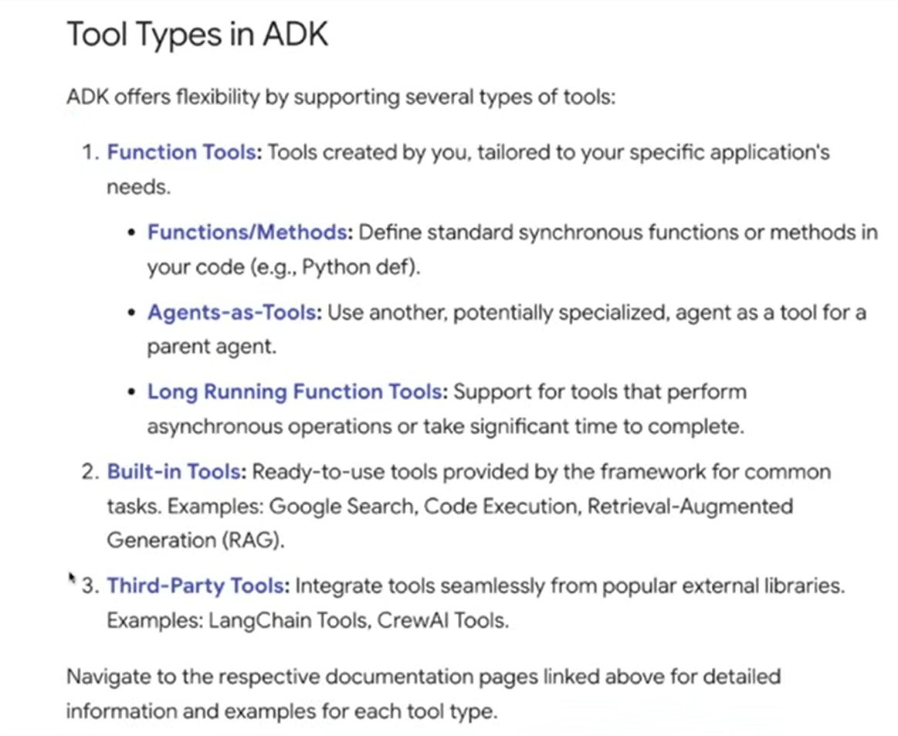

## Add tools to our agent (2-tool-agent)
adding tools to our agents, so that we can additional functionalities to our agents

### types of tools  
3 types:  

1. function tools: tools created by us
2. built-in tools lo google search and code execution works only for gemini models while in ADK's RAG (VertexAiRagRetrieval), the retrieval step works for other models too

### code change
new property/attribute to be added is 'tools'
ex: tools=[get_current_time]

NOTE: can only pass one built-in tool at a time  
can't do tools=[google_search, built_in_code_execution]

NOTE: we can't also add built-in tools and custom tools at the same time  
tools=[google_search, get_current_time]  X doesn't work