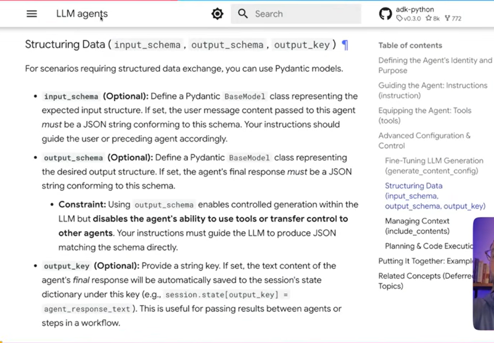
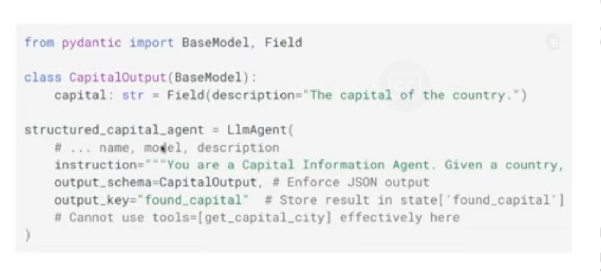

## Using LiteLLM (4-structured-outputs)

1. input_schema isn't really used so much, even if used it just breaks so much cuz there's no guarantee that the previous agent's putput is gonna hv the same schema as this input_schema
2. output_schema
3. output_key => this key is used to store the final response given by the agent into the session's state dictionary with the key privided




NOTE: sometimes if the agent's final response won't follow the output schema, hence it won't hurt for us to add the needed/intended schema inside the instructions attribute  
ex: 
```
instruction="""
    You are an Email Generation Assistant.
    Your task is to generate a professional email based on user's requests.

    GUIDELINES:
    - Create an appropriate subject line (concise and revelant)
    - Write a well-structured email body with:
        * Professional Greeting
        * Clear and concise main content
        * Appropriate closing
        * Your name as signature
    - Suggest relevant attachments if applicable (empty list if none needed)
    - Email tone should match the purpose (formal for business, friendly for colleagues)
    - Keep emails concise but complete

    IMPORTANT: Your response should be a valid JSON matching this structure:
    {
        "subject": "Subject line here",
        "body": "Email body here with proper paragraphs and formatting"
    }

    DO NOT include any additional text outsite of the JSON respone
    """,
```